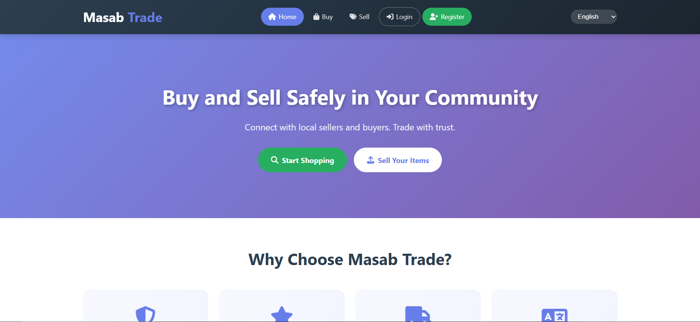
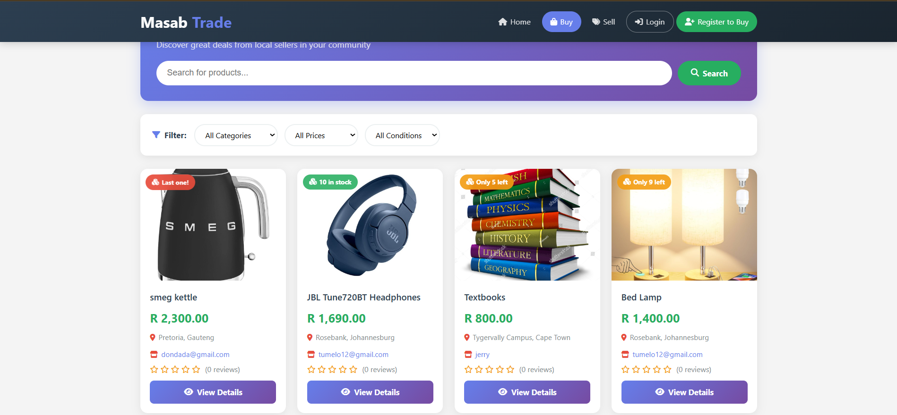
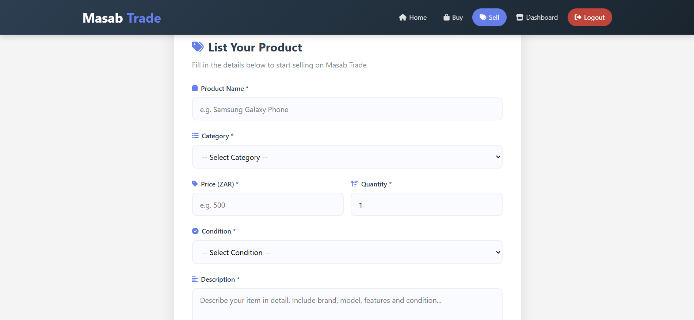
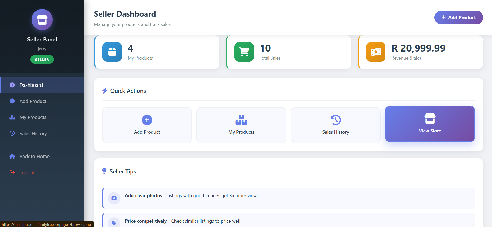
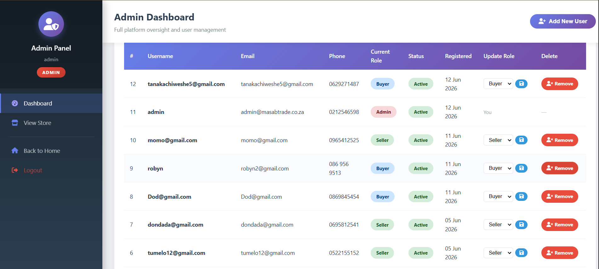

# 🛒 Masab Trade — C2C E-Commerce Platform







> A Consumer-to-Consumer (C2C) e-commerce platform built to empower South Africa's township economy — enabling individuals to buy and sell goods directly with each other, supported by a full admin management system with Role-Based Access Control (RBAC).

---

## 🌐 Live Demo

| Access Point | URL |
|---|---|
| **Main Website** | https://masabtrade.infinityfree.io/?i=1 |
| **Admin Login** | https://masabtrade.infinityfree.io/pages/admin/dashboard.php |


---

## 📋 Table of Contents

- [About the Project](#about-the-project)
- [Features](#features)
- [Tech Stack](#tech-stack)
- [Project Structure](#project-structure)
- [Database Setup](#database-setup)
- [Local Installation](#local-installation)
- [Live Hosting Setup](#live-hosting-setup)
- [User Roles](#user-roles)
- [Screenshots](#screenshots)
- [Academic Context](#academic-context)

---

## 📖 About the Project

Masab Trade is a fully hand-coded C2C e-commerce platform developed as part of a university software development project. The platform targets South Africa's township economy (estimated at R900 billion annually) and provides:

- A public marketplace where sellers list goods and buyers browse and purchase
- Direct buyer-seller communication via WhatsApp
- Multiple payment options suited to the South African informal economy (COD, Mobile Money, EFT)
- A secure admin panel for platform management with full RBAC
- Multi-language support in 5 South African languages

**No CMS (WordPress, Wix, etc.) was used. Every line of code is custom written.**

---

## ✨ Features

### 👤 Buyer
- Browse and search products with filters (category, price, condition)
- Real-time stock badge indicators on every product card
- Product detail modal with customer reviews and star ratings
- Full checkout: delivery method selection + payment method selection
- Order confirmation with success popup and WhatsApp seller contact
- Order history with status tracking
- Leave star ratings and written reviews per order

### 🏪 Seller
- Register with business name and description
- List products with image upload, quantity, condition, category
- Manage stock quantities inline (updates available/out-of-stock status)
- View all incoming orders with buyer contact details
- Update order status (Pending → Confirmed → Shipped → Delivered → Cancelled)
- Auto-cascade: marking Delivered auto-marks payment as Paid and transaction as Completed
- Seller dashboard with revenue and sales stats

### 🛡️ Admin (RBAC)
- **Create** — Add new users (buyer/seller/admin) via modal form
- **Read** — View all registered users in a management table
- **Update** — Change any user's role with inline dropdown
- **Delete** — Remove users permanently (self-deletion blocked)
- Platform-wide stats: users, products, orders, paid revenue
- Recent order monitoring across all sellers

### 🌍 Multi-Language
| Code | Language |
|---|---|
| `en` | English |
| `zu` | isiZulu |
| `xh` | isiXhosa |
| `af` | Afrikaans |
| `st` | Sepedi |

---

## 🛠️ Tech Stack

| Technology | Purpose |
|---|---|
| HTML5 | Page structure and semantic markup |
| CSS | Responsive design, animations, layout |
| JavaScript (Vanilla) | Modal, filters, stock display, session timer |
| PHP | Server-side logic, sessions, CRUD, RBAC |
| MySQL | Relational database (8 tables) |
| Font Awesome 6.5 | UI icons |
| JSON | Language translation files |

---

## 📁 Project Structure

```
e_commerce/
│
├── index.php                          # Homepage
│
├── assets/
│   ├── images/
│   │   └── products/                  # Sample product images
│   └── languages/
│       ├── en.json                    # English
│       ├── zu.json                    # isiZulu
│       ├── xh.json                    # isiXhosa
│       ├── af.json                    # Afrikaans
│       └── st.json                    # Sepedi
│
├── css/
│   ├── style.css                      # Global styles / header / footer
│   ├── auth.css                       # Login & register pages
│   ├── buyer.css                      # Browse page & product modal
│   ├── seller.css                     # Add product page
│   ├── dashboard.css                  # All dashboards (buyer/seller/admin)
│   ├── checkout.css                   # Checkout & order confirmation
│   └── info-pages.css                 # Privacy, Terms, Help, Seller Guide
│
├── js/
│   ├── main.js                        # Session timeout, smooth scroll
│   ├── buyer.js                       # Product modal, filters, buy now
│   ├── seller.js                      # Image preview, form validation
│   └── language.js                    # Multi-language switcher
│
├── pages/
│   ├── browse.php                     # Public product listing page
│   ├── add-product.php                # Seller: list new product
│   │
│   ├── auth/
│   │   ├── login.php                  # Login (all roles)
│   │   └── register.php               # Registration (buyer or seller)
│   │
│   ├── buyer/
│   │   ├── dashboard.php              # Buyer home
│   │   ├── orders.php                 # Order history + review buttons
│   │   ├── checkout.php               # Checkout flow
│   │   └── order-confirmation.php     # Success page + review form
│   │
│   ├── seller/
│   │   ├── dashboard.php              # Seller home + stats
│   │   ├── manage-products.php        # Product table + qty update
│   │   └── sales-history.php          # Incoming orders + status update
│   │
│   ├── admin/
│   │   └── dashboard.php              # Admin CRUD user management
│   │
│   ├── privacy-policy.php
│   ├── terms-of-service.php
│   ├── help-center.php
│   └── seller-guide.php
│
├── backend/
│   ├── config/
│   │   └── database.php               # ⚠️  DATABASE CONFIG (in .gitignore)
│   ├── includes/
│   │   ├── session-manager.php        # Session start + timeout logic
│   │   └── auth-check.php             # Role-based route guards
│   └── auth/
│       └── logout.php                 # Session destroy + redirect
│
├── uploads/
│   └── products/                      # ⚠️  Uploaded images (in .gitignore)
│
├── database/
│   └── schema.sql                     # Full DB schema — run this first
│
├── .gitignore
└── README.md
```

---

## 🗄️ Database Setup

The database is named `c2c_platform` and contains **8 tables**:

| Table | Purpose |
|---|---|
| `users` | All user accounts with roles |
| `seller_profiles` | Extended seller info (business name, rating) |
| `products` | All product listings |
| `orders` | Purchase records |
| `transactions` | Payment records |
| `reviews` | Buyer ratings and written feedback |
| `messages` | Buyer-seller messaging |
| `cart` | Shopping cart items |


---

## 🌐 Live Hosting Setup (InfinityFree / cPanel)

1. Hosted on InfinityFree [InfinityFree](https://infinityfree.com) 
2. Created a **MySQL database** from the hosting control panel
   - Database host
   - Database name
   - Database username
   - Database password
3. Updated `backend/config/database.php` with the live credentials
4. Uploaded all project files via **FileZilla FTP** to the `htdocs/`
5. Imported `database/schema.sql` via the hosting phpMyAdmin
6. Ran the admin password and reset SQL above


---

## 👥 User Roles

| Role | Register At | Dashboard |
|---|---|---|
| **Buyer** | `/pages/auth/register.php` (select "Buy Products") | `/pages/buyer/dashboard.php` |
| **Seller** | `/pages/auth/register.php` (select "Sell Products") | `/pages/seller/dashboard.php` |
| **Admin** | Created by existing admin or via `reset-admin.php` | `/pages/admin/dashboard.php` |

---

## 🎓 Academic Context

**Course:** Web Development and e-commerce 3
**Deliverable:** Prototype + Final Presentation (Deliverable 2 & 3)
**Model:** Consumer-to-Consumer (C2C)
**Platform focus:** South African Township Economy

### Required Diagrams (Deliverable 2)
- ✅ CRC Cards
- ✅ Enhanced Entity Relationship Diagram (EERD)
- ✅ Context Diagram
- ✅ Data Flow Diagram (DFD Level 1)
- ✅ Use Case Diagram
- ✅ Database Schema Design

### Technical Requirements Met
- ✅ HTML, CSS, JavaScript, PHP, MySQL
- ✅ No CMS or page builder used
- ✅ Hosted on live server (no localhost submission)
- ✅ Admin RBAC: Create, Read, Update, Delete users
- ✅ GitHub repository submitted

---

## ⚠️ Security Notes

- `backend/config/database.php` is excluded from version control via `.gitignore`
- All passwords hashed with `password_hash()` (bcrypt)
- All queries use prepared statements (SQL injection prevention)
- All output passed through `htmlspecialchars()` (XSS prevention)
- Session timeout: 5 minutes inactivity
- Admin cannot delete their own account
- Sellers cannot purchase their own products

---

## 📄 License

This project was developed for academic purposes.
© 2026 Masab Trade. All rights reserved.